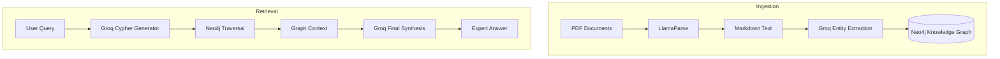

# Project Title : Financial Document Analysis with Graph-RAG & LLM

# 🚀 Key Features
Metadata Integrity: Sequential processing ensures every page is tagged with its source file.
Relationship-Aware: Captures connections across different pages and documents.
High Performance: Leverages Groq's LPUs for near-instant extraction and querying.
Scalable: Built on Neo4j Aura for cloud-native graph storage.

# 🛠️ Tech Stack
LLM: Llama 3.3 (via Groq)
Parser: LlamaParse
Database: Neo4j Aura (Graph)
Environment: Python / Jupyter Notebook

---

## 🧪 Research & Benchmarking
This repository includes a `research_traditional_rag` under Test_RAG folder (based on foundational tutorials by Krish Naik). I maintained this as a baseline to compare performance against the current GraphRAG implementation.

**Key Findings:**
* **Traditional RAG:** Excellent for simple fact retrieval but struggled with "global" queries across multiple document sections.
* **GraphRAG (Current):** Significantly improved entity relationship mapping and cross-document synthesis.

## 📂 Data Source
Graph_RAG project uses the **Apple 2024-2025 10-Q filing** as the primary test case. 
The document is located in the `/data/financial_pdf` folder. It was selected for its complex 
financial tables and nested entity relationships, which perfectly demonstrate 
the power of GraphRAG over traditional RAG.
